# Architecture Diagrams

This document provides comprehensive visual representations of the Nanopore Tracking Application architecture, workflows, and system components.

## Table of Contents
- [System Architecture Overview](#system-architecture-overview)
- [Technical Architecture](#technical-architecture)
- [Sample Tracking Workflow](#sample-tracking-workflow)

---

## System Architecture Overview

This diagram shows the complete system architecture including microservices, data hierarchy, workflows, and infrastructure components.


### Key Components

#### Microservices Architecture
- **API Gateway** (Port 3001): Central entry point for all client requests
- **Sample Management Service** (Port 3002): Handles sample CRUD operations and workflow management
- **AI Processing Service** (Port 3003): PDF extraction, LLM integration, and RAG system
- **Authentication Service** (Port 3004): User authentication and authorization
- **File Storage Service** (Port 3005): Document and attachment management
- **Audit Service** (Port 3006): Comprehensive audit trail and compliance logging

#### Data Hierarchy
The system follows a hierarchical data structure:
1. **Projects**: Top-level organizational units
2. **Submissions**: HTSF quote submissions under projects
3. **Samples**: Individual samples under submissions

#### Laboratory Workflow
Eight-step process for nanopore sequencing:
1. Sample QC - Initial quality control
2. Library Preparation - Sample processing
3. Library QC - Library validation
4. Sequencing Setup - Configure sequencing run
5. Sequencing Run - Execute sequencing
6. Basecalling - Convert electrical signals to base calls
7. Quality Assessment - Validate results
8. Data Delivery - Transfer data to customer

---

## Technical Architecture

This diagram focuses on the technology stack, design patterns, and technical components of the application.


### Technology Stack

#### Frontend
- **Astro 5.x**: Server-side rendering framework
- **React 19**: UI component library
- **TypeScript**: Type-safe JavaScript
- **Tailwind CSS**: Utility-first CSS framework
- **Radix UI**: Accessible component primitives

#### Backend
- **tRPC**: Type-safe API layer
- **Zod**: Runtime schema validation
- **Kysely**: Type-safe SQL query builder
- **PostgreSQL**: Primary database
- **Redis**: Caching and session storage

#### AI/ML Pipeline
- **Ollama**: Local LLM inference
- **RAG System**: Retrieval-augmented generation
- **Pattern Matching**: Rule-based extraction
- **Confidence Scoring**: Quality assessment

#### Infrastructure
- **Docker**: Containerization
- **Kubernetes/OpenShift**: Container orchestration
- **Prometheus**: Metrics collection
- **Grafana**: Metrics visualization

---

## Sample Tracking Workflow

This diagram details the complete sample lifecycle, status transitions, and validation requirements.

```mermaid
flowchart LR
    subgraph "Sample Submission Process"
        Upload["📤 Upload<br/>PDF/CSV"]
        Extract["🤖 AI Extraction<br/>(LLM + RAG)"]
        Validate["✅ Validation<br/>(Zod Schemas)"]
        Create["💾 Create Sample<br/>(Database)"]
        
        Upload --> Extract
        Extract --> Validate
        Validate --> Create
    end

    subgraph "Sample Status Lifecycle"
        S1["📝 SUBMITTED<br/>Initial submission"]
        S2["🧪 PREP<br/>Library preparation"]
        S3["🧬 SEQUENCING<br/>Active sequencing"]
        S4["📊 ANALYSIS<br/>Data analysis"]
        S5["✅ COMPLETED<br/>Processing finished"]
        S6["📦 DISTRIBUTED<br/>Delivered to customer<br/>(NEW STATUS)"]
        S7["📁 ARCHIVED<br/>Long-term storage"]
        
        S1 -->|"Assign to staff"| S2
        S2 -->|"Start sequencing"| S3
        S3 -->|"Begin analysis"| S4
        S4 -->|"Finish processing"| S5
        S5 -->|"Deliver to customer"| S6
        S6 -->|"Move to storage"| S7
        
        S1 -.->|"Cancel"| Cancelled["❌ CANCELLED"]
        S2 -.->|"Fail QC"| Failed["⚠️ FAILED"]
        S3 -.->|"Error"| Failed
        S4 -.->|"Issues"| Failed
        Failed -.->|"Retry"| S2
    end

    subgraph "Laboratory Workflow (8 Steps)"
        W1["1️⃣ Sample QC<br/>Quality check"]
        W2["2️⃣ Library Prep<br/>Sample preparation"]
        W3["3️⃣ Library QC<br/>Library validation"]
        W4["4️⃣ Sequencing Setup<br/>Configure run"]
        W5["5️⃣ Sequencing Run<br/>Execute sequencing"]
        W6["6️⃣ Basecalling<br/>Convert signals"]
        W7["7️⃣ Quality Assessment<br/>Validate results"]
        W8["8️⃣ Data Delivery<br/>Transfer to customer"]
        
        W1 --> W2
        W2 --> W3
        W3 --> W4
        W4 --> W5
        W5 --> W6
        W6 --> W7
        W7 --> W8
    end

    subgraph "Priority System"
        P1["🔵 LOW<br/>Standard processing"]
        P2["🟢 NORMAL<br/>Regular queue"]
        P3["🟡 HIGH<br/>Expedited"]
        P4["🔴 URGENT<br/>Priority handling"]
        
        P1 -.->|"Escalate"| P2
        P2 -.->|"Escalate"| P3
        P3 -.->|"Escalate"| P4
    end

    subgraph "Key Validations"
        V1["Chart Field<br/>HTSF-XXX<br/>NANO-XXX<br/>SEQ-XXX"]
        V2["Concentration<br/>DNA: 0.1-1000 ng/μL<br/>RNA: 0.01-100 ng/μL"]
        V3["Flow Cell<br/>R9.4.1<br/>R10.4.1<br/>R10.5.1"]
        V4["Volume<br/>0.1-1000 μL"]
    end

    subgraph "Assignment & Tracking"
        Staff["👥 Staff Members<br/>Grey, Stephanie, Jenny"]
        Audit["📋 Audit Trail<br/>All changes logged"]
        Notify["📧 Notifications<br/>Status updates"]
        
        Staff --> Audit
        Audit --> Notify
    end

    Create --> S1
    S1 -.->|"Maps to"| W1
    S2 -.->|"Maps to"| W2
    S3 -.->|"Maps to"| W5
    S4 -.->|"Maps to"| W6
    S5 -.->|"Maps to"| W7
    S6 -.->|"Maps to"| W8
    
    Create --> V1
    Create --> V2
    Create --> V3
    Create --> V4
    
    S1 --> P2
    Staff --> S2
    
    classDef submitted fill:#e3f2fd,stroke:#1565c0,stroke-width:2px
    classDef processing fill:#fff3e0,stroke:#ef6c00,stroke-width:2px
    classDef completed fill:#e8f5e9,stroke:#2e7d32,stroke-width:2px
    classDef distributed fill:#f3e5f5,stroke:#6a1b9a,stroke-width:3px
    classDef failed fill:#ffebee,stroke:#c62828,stroke-width:2px
    classDef workflow fill:#e0f2f1,stroke:#00695c,stroke-width:2px
    classDef priority fill:#fce4ec,stroke:#ad1457,stroke-width:2px
    
    class S1 submitted
    class S2,S3,S4 processing
    class S5 completed
    class S6 distributed
    class S7,Cancelled,Failed failed
    class W1,W2,W3,W4,W5,W6,W7,W8 workflow
    class P1,P2,P3,P4 priority
```



### Workflow Details

#### Sample Submission
1. **Upload**: PDF quote forms (HTSF format) or CSV bulk uploads
2. **AI Extraction**: Multi-strategy extraction using LLM, RAG, and pattern matching
3. **Validation**: Zod schemas ensure data integrity
4. **Creation**: Samples created in database with full audit trail

#### Status Transitions
- **SUBMITTED** → **PREP**: Sample assigned to laboratory staff
- **PREP** → **SEQUENCING**: Library preparation complete, sequencing begins
- **SEQUENCING** → **ANALYSIS**: Sequencing complete, data analysis starts
- **ANALYSIS** → **COMPLETED**: All processing finished
- **COMPLETED** → **DISTRIBUTED**: Data delivered to customer (NEW)
- **DISTRIBUTED** → **ARCHIVED**: Sample moved to long-term storage

#### Priority Levels
- **LOW**: Standard processing timeline
- **NORMAL**: Regular queue priority (default)
- **HIGH**: Expedited processing
- **URGENT**: Immediate attention required

#### Validation Requirements

##### Chart Fields
- Format: `PREFIX-###`
- Valid prefixes: HTSF, NANO, SEQ
- Example: `HTSF-001`

##### Concentration Ranges
- **DNA**: 0.1 - 1000 ng/μL
- **RNA**: 0.01 - 100 ng/μL
- **Protein**: 0.001 - 10 ng/μL

##### Flow Cell Types
- R9.4.1 (standard)
- R10.4.1 (high accuracy)
- R10.5.1 (latest version)

##### Volume Requirements
- Minimum: 0.1 μL
- Maximum: 1000 μL
- Typical range: 10-50 μL

---

## Recent Updates

### New "Distributed" Status
The system now includes a **"distributed"** status to track when samples/data have been delivered to customers. This status:
- Sits between "completed" and "archived" in the workflow
- Indicates successful delivery to the customer
- Triggers notifications and billing processes
- Maintains full audit trail of delivery details

### Database Migration
A migration has been created to add the "distributed" status:
- File: `database/migrations/1754400000000_add_distributed_status.sql`
- Updates status constraint to include "distributed"
- Adds appropriate indexes for performance

---

## Deployment Architecture

### Local Development
```bash
pnpm dev  # Runs on http://localhost:3001
```

### Docker Compose Options
- **Basic**: `docker-compose.yml` - Single container with PostgreSQL
- **Development**: `docker-compose.dev.yml` - Full dev environment
- **Microservices**: `docker-compose.microservices.yml` - Complete microservices architecture

### Production Deployment
- **Kubernetes/OpenShift**: Full orchestration with auto-scaling
- **Azure AKS**: Cloud-native deployment
- **Resource limits**: Optimized for quota-constrained environments

---

## Monitoring & Observability

### Metrics Collection
- **Prometheus** (Port 9090): Time-series metrics database
- **Grafana** (Port 3000): Visualization and dashboards
- Custom metrics for:
  - Sample processing times
  - API response times
  - Error rates
  - Resource utilization

### Logging
- Structured JSON logging
- Correlation IDs for request tracing
- Log levels: DEBUG, INFO, WARNING, ERROR, CRITICAL
- Centralized log aggregation

### Health Checks
- `/health` endpoint for each service
- Readiness and liveness probes
- Circuit breaker patterns for resilience

---

## Security & Compliance

### Authentication & Authorization
- **Better-auth** for user authentication
- Role-based access control (RBAC)
- JWT tokens with proper expiration
- Session management with Redis

### Data Protection
- Input sanitization on all endpoints
- SQL injection prevention via parameterized queries
- XSS protection through content security policies
- CORS configuration for cross-origin requests

### Audit Trail
- Comprehensive logging of all data changes
- User action tracking
- Retention policies for compliance
- Immutable audit logs

---

## Performance Optimization

### Caching Strategy
- Redis for session storage
- Query result caching
- Static asset caching
- CDN integration for production

### Database Optimization
- Connection pooling
- Query optimization with Kysely
- Appropriate indexing strategies
- Read replicas for scaling

### Resource Management
- Memory-optimized configurations
- Horizontal scaling capabilities
- Load balancing across services
- Auto-scaling based on metrics

---

## Documentation & Support

For additional information, please refer to:
- [Quick Reference Guide](QUICK_REFERENCE.md)
- [Implementation Guide](COMPLETE_IMPLEMENTATION_GUIDE.md)
- [Production Runbook](PRODUCTION_RUNBOOK.md)
- [Microservices Migration Plan](MICROSERVICES_MIGRATION_PLAN.md)

Repository: [GitHub - nanopore-tracking-app](https://github.com/unc-barc/nanopore-tracking-app)
