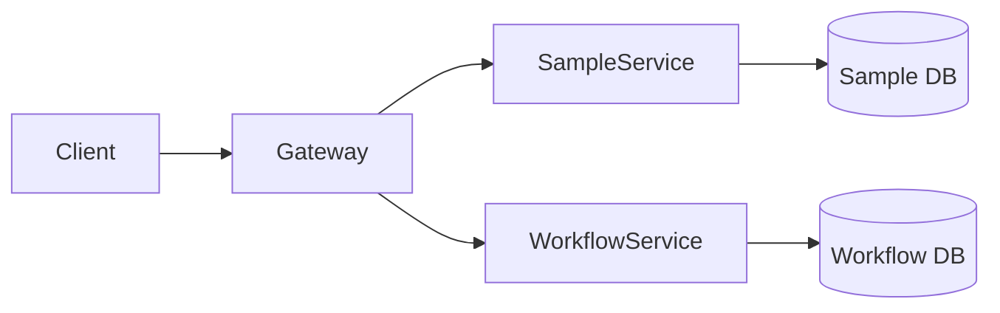
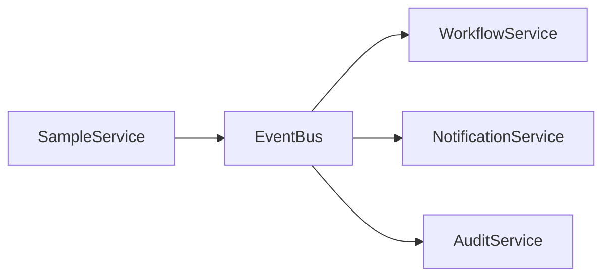

# Microservices Architecture for Nanopore Tracking

## Service Decomposition

### 1. Core Domain Services

#### Sample Management Service (Python)
- **Responsibility**: CRUD operations for samples, status management
- **Database**: PostgreSQL (sample_management_db)
- **API**: FastAPI with async support
- **Key Features**:
  - Sample lifecycle management
  - Priority queue handling
  - Batch operations support

#### Workflow Orchestration Service (Python)
- **Responsibility**: Managing the 8-step nanopore workflow
- **Database**: PostgreSQL (workflow_db)
- **Communication**: Event-driven with Redis pub/sub
- **Key Features**:
  - State machine for workflow steps
  - Automatic step progression
  - SLA monitoring

#### AI Processing Service (Python)
- **Responsibility**: PDF extraction, data validation, recommendations
- **External Dependencies**: Ollama for LLM
- **Key Features**:
  - Multi-stage extraction pipeline
  - Confidence scoring
  - RAG-enhanced validation

### 2. Supporting Services

#### Notification Service (TypeScript)
- **Responsibility**: Email, in-app notifications, webhooks
- **Queue**: Redis-based job queue
- **Features**:
  - Template management
  - Delivery tracking
  - Retry logic

#### Export Service (Python)
- **Responsibility**: Data transformation and export
- **Storage**: S3-compatible object storage
- **Features**:
  - Multiple format support (CSV, Excel, JSON, XML)
  - Async processing for large datasets
  - Scheduled exports

### 3. Infrastructure Services

#### API Gateway (TypeScript)
- **Framework**: Express with tRPC
- **Features**:
  - Request routing
  - Rate limiting
  - Authentication forwarding
  - Request/response transformation

#### Event Bus (Redis)
- **Pattern**: Pub/Sub for inter-service communication
- **Events**:
  - SampleCreated
  - WorkflowStepCompleted
  - ExportRequested
  - NotificationTriggered

## Communication Patterns

### Synchronous Communication


### Asynchronous Communication


## Service Contracts

### Sample Service API
```python
# POST /api/v1/samples
{
  "sampleName": "string",
  "submitterEmail": "string",
  "priority": "normal|high|urgent",
  "flowCellType": "R9.4.1|R10.4.1|R10.5.1",
  # ... other fields
}

# GET /api/v1/samples/{id}/workflow
{
  "currentStep": "library_prep",
  "progress": 3,
  "totalSteps": 8,
  "estimatedCompletion": "2024-01-20T15:00:00Z"
}
```

## Deployment Strategy

### Container Orchestration
- Each service runs in its own container
- Health checks and readiness probes
- Resource limits based on service requirements
- Auto-scaling based on load

### Service Discovery
- DNS-based service discovery in Kubernetes/OpenShift
- Environment-specific service URLs
- Circuit breakers for resilience

## Monitoring and Observability

### Metrics Collection
- Prometheus metrics for each service
- Custom business metrics (samples processed, workflow completion time)
- Resource utilization tracking

### Distributed Tracing
- OpenTelemetry integration
- Request flow visualization
- Performance bottleneck identification

### Centralized Logging
- Structured JSON logs
- Correlation IDs for request tracking
- Log aggregation with ELK stack 