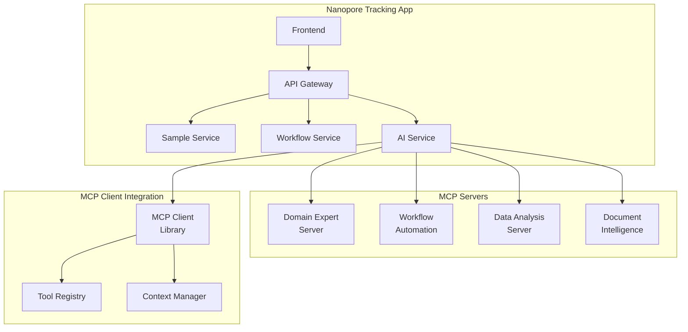

# MCP Integration Plan for Nanopore Tracking

## Overview

MCP (Model Context Protocol) can significantly enhance the nanopore tracking application by providing specialized AI-powered tools for domain-specific operations.

## Proposed MCP Servers

### 1. Nanopore Domain Expert Server

**Purpose**: Provide domain-specific knowledge and validation for nanopore sequencing

**Tools**:
```typescript
interface NanoporeMCPTools {
  // Validate sample parameters against best practices
  validateSampleParameters(params: {
    concentration: number
    volume: number
    purityRatio: number
    fragmentSize: number
    sampleType: string
  }): ValidationResult

  // Suggest optimal flow cell based on sample characteristics
  recommendFlowCell(params: {
    sampleType: string
    expectedYield: number
    readLengthTarget: number
  }): FlowCellRecommendation

  // Predict sequencing run duration and success
  predictSequencingOutcome(params: {
    sampleMetrics: SampleMetrics
    flowCellType: string
    environmentalConditions?: EnvironmentalData
  }): SequencingPrediction

  // Generate QC report with insights
  generateQCInsights(params: {
    qcData: QualityControlData
    historicalData?: HistoricalQCData[]
  }): QCInsightReport
}
```

### 2. Workflow Automation Server

**Purpose**: Intelligent workflow management and automation

**Tools**:
```typescript
interface WorkflowMCPTools {
  // Analyze workflow bottlenecks
  analyzeWorkflowPerformance(params: {
    workflowId: string
    timeRange: DateRange
  }): PerformanceAnalysis

  // Suggest workflow optimizations
  optimizeWorkflowSchedule(params: {
    pendingSamples: Sample[]
    resourceAvailability: ResourceData
    priorities: PriorityMatrix
  }): OptimizedSchedule

  // Predict completion times with ML
  predictCompletionTime(params: {
    currentStep: number
    historicalDurations: Duration[]
    sampleCharacteristics: SampleData
  }): CompletionPrediction

  // Auto-assign samples to operators
  intelligentAssignment(params: {
    samples: Sample[]
    operators: Operator[]
    workload: WorkloadData
  }): AssignmentRecommendations
}
```

### 3. Data Analysis Server

**Purpose**: Advanced data analysis and insights generation

**Tools**:
```typescript
interface AnalysisMCPTools {
  // Analyze sequencing quality trends
  analyzeQualityTrends(params: {
    samples: Sample[]
    timeRange: DateRange
    groupBy: 'operator' | 'flowCell' | 'sampleType'
  }): TrendAnalysis

  // Generate custom reports
  generateCustomReport(params: {
    template: ReportTemplate
    filters: DataFilters
    format: 'pdf' | 'excel' | 'html'
  }): GeneratedReport

  // Anomaly detection in sequencing data
  detectAnomalies(params: {
    sequencingData: SequencingData[]
    sensitivityLevel: 'low' | 'medium' | 'high'
  }): AnomalyReport

  // Batch quality comparison
  compareBatchQuality(params: {
    batchIds: string[]
    metrics: QualityMetric[]
  }): ComparisonReport
}
```

### 4. Document Intelligence Server

**Purpose**: Enhanced document processing and form extraction

**Tools**:
```typescript
interface DocumentMCPTools {
  // Extract data from various document formats
  extractFromDocument(params: {
    document: File
    documentType: 'submissionForm' | 'qcReport' | 'invoice'
    extractionStrategy: 'aggressive' | 'conservative'
  }): ExtractedData

  // Validate extracted data against templates
  validateExtraction(params: {
    extractedData: any
    template: DocumentTemplate
    strictMode: boolean
  }): ValidationResult

  // Auto-fill forms from historical data
  autoFillForm(params: {
    formType: string
    historicalData: HistoricalSubmission[]
    partialData?: Partial<FormData>
  }): AutoFilledForm

  // Generate submission forms
  generateSubmissionForm(params: {
    sampleData: Sample
    template: 'standard' | 'detailed' | 'minimal'
  }): GeneratedForm
}
```

## Implementation Architecture



## Integration Points

### 1. Sample Submission Flow
```typescript
// Before MCP
const handlePDFUpload = async (file: File) => {
  const extracted = await extractWithPatterns(file)
  const sample = await createSample(extracted)
}

// With MCP
const handlePDFUpload = async (file: File) => {
  // Use MCP for intelligent extraction
  const extracted = await mcpClient.call('extractFromDocument', {
    document: file,
    documentType: 'submissionForm',
    extractionStrategy: 'aggressive'
  })
  
  // Validate with domain expert
  const validation = await mcpClient.call('validateSampleParameters', {
    ...extracted.sampleMetrics
  })
  
  // Get flow cell recommendation
  const recommendation = await mcpClient.call('recommendFlowCell', {
    sampleType: extracted.sampleType,
    expectedYield: extracted.expectedYield
  })
  
  const sample = await createSample({
    ...extracted,
    ...recommendation,
    validationScore: validation.score
  })
}
```

### 2. Workflow Management
```typescript
// Intelligent workflow automation
const processWorkflowStep = async (sampleId: string, step: number) => {
  // Get optimization suggestions
  const optimization = await mcpClient.call('optimizeWorkflowSchedule', {
    pendingSamples: await getPendingSamples(),
    resourceAvailability: await getResources(),
    priorities: await getPriorityMatrix()
  })
  
  // Apply optimizations
  await applyScheduleOptimizations(optimization)
  
  // Predict completion
  const prediction = await mcpClient.call('predictCompletionTime', {
    currentStep: step,
    historicalDurations: await getHistoricalData(),
    sampleCharacteristics: await getSampleData(sampleId)
  })
  
  // Update UI with predictions
  await updateCompletionEstimate(sampleId, prediction)
}
```

### 3. Quality Analysis
```typescript
// Enhanced QC analysis
const performQCAnalysis = async (qcData: QualityControlData) => {
  // Get AI insights
  const insights = await mcpClient.call('generateQCInsights', {
    qcData,
    historicalData: await getHistoricalQC()
  })
  
  // Detect anomalies
  const anomalies = await mcpClient.call('detectAnomalies', {
    sequencingData: [qcData],
    sensitivityLevel: 'medium'
  })
  
  // Generate comprehensive report
  return {
    insights,
    anomalies,
    recommendations: insights.recommendations
  }
}
```

## Benefits

1. **Enhanced Accuracy**: AI-powered validation and recommendations
2. **Automation**: Reduce manual work with intelligent automation
3. **Insights**: Deep analysis and trend detection
4. **Scalability**: Offload complex computations to MCP servers
5. **Flexibility**: Easy to add new capabilities without changing core code

## Deployment Strategy

1. **Phase 1**: Deploy Document Intelligence server for PDF processing
2. **Phase 2**: Add Domain Expert server for validations
3. **Phase 3**: Implement Workflow Automation
4. **Phase 4**: Full Data Analysis capabilities

## Security Considerations

- MCP servers run in isolated containers
- Authentication via JWT tokens
- Rate limiting on all endpoints
- Audit logging for compliance
- Data encryption in transit and at rest 